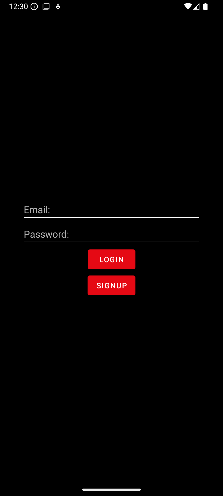

# Netflix clone

Netflix clone is created in android with MVVM architecture. It uses APIs from [TMDB - The Movie Database](https://www.themoviedb.org/documentation/api). It contains features like Trailer playback, Home feed, Movies coming soon, Search / View for movie, tv shows.

## Preview



## Download APK
Download and try the latest apk from [here](https://github.com/Gopalakrishnan-V/netflix-clone/releases)

## Local setup
* Generate an api_key from [https://developers.themoviedb.org/3](https://developers.themoviedb.org/3)\
* Update the following line in local.properties
```
api_key=YOUR_TMDB_API_KEY
```

## Contributing
Pull requests are welcome. For major changes, please open an issue first to discuss what you would like to change.
